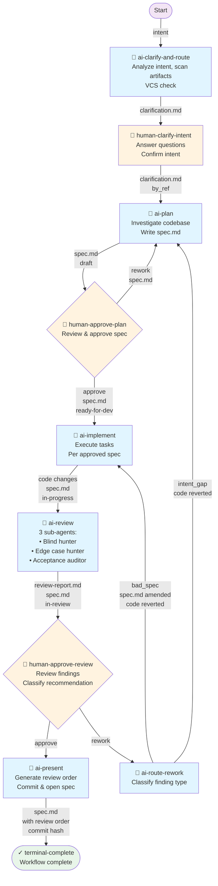

# BMAD Quick Dev Flow — Clarify, Plan, Implement, Review, Present

## Overview

HGSDLC representation of the **bmad-quick-dev** workflow for full-cycle code development:

1. **Clarify** intent and route
2. **Plan** implementation with human approval
3. **Implement** per approved spec
4. **Review** with 3 sub-agents (adversarial analysis)
5. **Route rework** — distinguish bad_spec (re-implement) from intent_gap (re-plan)
6. **Present** with suggested review order

Each stage has human gates with rework loops. Use this flow for **plan-code-review route** (not zero-blast-radius changes — use `bmad-quick-dev-oneshot-flow` instead).

---

## Flow Graph



---

## Node Details

### 1. ai-clarify-and-route
**Type:** `ai`  
**Checkpoint:** No  
**Produces:** `clarification.md`

Analyzes user intent and performs checks:
- Scan planning artifacts (PRD, architecture, UX, epics)
- List active specs and ask which to resume
- Multi-goal check (split if 2+ independent shippable goals)
- VCS sanity check (clean tree, matching branch name)
- Generate clarification questions if needed

Routes to next step: `human-clarify-intent`

---

### 2. human-clarify-intent
**Type:** `human_input`  
**Modifiable Artifact:** `clarification.md`

Human answers clarification questions, confirms intent, and can add context or constraints.

Routes to next step: `ai-plan`

---

### 3. ai-plan
**Type:** `ai`  
**Checkpoint:** Yes  
**Retry Policy:** 2 attempts on `AGENT_EXECUTION_FAILED`, `AGENT_SESSION_RESUME_FAILED`  
**Produces:** `spec.md` (status: `draft` → `ready-for-dev` after approval)

Investigates codebase and writes implementation spec per template:
- Intent, Approach, Constraints
- Tasks & Acceptance (Given/When/Then)
- Code Map (files to create/modify)
- Design Notes
- Spec Change Log (empty initially)

Self-review against "Ready for Development" standard. Token count target: 900–1600.

Routes:
- **on_success:** `human-approve-plan`
- **on_failure:** `terminal-complete`

---

### 4. human-approve-plan
**Type:** `human_approval`  
**Freezes:** `<frozen-after-approval>` block in spec

Human reviews spec for:
- Correct intent capture
- Actionable tasks with file paths and Create/Modify actions
- Testable acceptance criteria (Given/When/Then)
- No TBDs or placeholders
- Reasonable scope (900–1600 tokens)

Can edit spec inline before approving. Sets spec status to `ready-for-dev` on approve.

Routes:
- **on_approve:** `ai-implement`
- **on_rework:** `ai-plan` (full spec revision)

---

### 5. ai-implement
**Type:** `ai`  
**Checkpoint:** Yes  
**Retry Policy:** 2 attempts on `AGENT_EXECUTION_FAILED`, `AGENT_SESSION_RESUME_FAILED`  
**Reads:** `spec.md` (status: `ready-for-dev` → `in-progress`)

Implements per approved spec:
- Records `baseline_commit` (HEAD or `NO_VCS`)
- Loads context docs if specified in spec frontmatter
- Hands to sub-agent (or implements directly)
- Executes tasks in order, marks each `[x]`
- No remote push

Routes:
- **on_success:** `ai-review`
- **on_failure:** `terminal-complete`

---

### 6. ai-review
**Type:** `ai`  
**Checkpoint:** No  
**Retry Policy:** 2 attempts on `AGENT_EXECUTION_FAILED`, `AGENT_SESSION_RESUME_FAILED`  
**Reads:** `spec.md` (status: `in-progress` → `in-review`)  
**Produces:** `review-report.md`

Orchestrates three independent reviews (sub-agents or inline):

1. **Blind hunter** (`bmad-review-adversarial-general`)  
   Diff only, no spec, no project access. Cynical review.

2. **Edge case hunter** (`bmad-review-edge-case-hunter`)  
   Diff + project access. Exhaustive edge-case analysis.

3. **Acceptance auditor**  
   Diff + spec + project + referenced docs. Checks AC violations and principle breaches.

Classifies findings:
- **intent_gap** — incomplete frozen intent → escalate to human
- **bad_spec** — spec should have been clearer → amend spec + re-implement
- **patch** — trivially fixable → auto-apply
- **defer** — pre-existing, not caused by this change
- **reject** — noise

Writes `review-report.md` with classification table and recommendation:
- `approve` → proceed to present
- `rework-spec` (bad_spec)
- `rework-intent` (intent_gap)

Routes:
- **on_success:** `human-approve-review`
- **on_failure:** `terminal-complete`

---

### 7. human-approve-review
**Type:** `human_approval`

Human reviews `review-report.md` findings and recommendations. Can:
- **Approve** → proceed to presentation (if recommendation is "approve")
- **Request rework** → resolve finding + proceed to routing node

Routes:
- **on_approve:** `ai-present`
- **on_rework:** `ai-route-rework` (distinguishes bad_spec vs intent_gap)

---

### 8. ai-route-rework
**Type:** `ai`  
**Checkpoint:** No  
**Reads:** `review-report.md`, `spec.md`  
**Writes:** Reverted code + amended spec (for bad_spec) OR reverted code (for intent_gap)

Routes rework based on blocking finding category:

**PATH A — bad_spec (rework-spec):**
1. Revert code changes (keep spec)
2. Extract KEEP instructions (what worked well)
3. Amend non-frozen spec sections containing root cause
4. Append Spec Change Log entry
5. Success → re-implement from amended spec

**PATH B — intent_gap (rework-intent):**
1. Revert code changes
2. Signal failure → re-plan from scratch

Routes:
- **on_success:** `ai-implement` (bad_spec case)
- **on_failure:** `ai-plan` (intent_gap case, escalates to full replanning)

---

### 9. ai-present
**Type:** `ai`  
**Checkpoint:** No  
**Reads:** `spec.md`, `review-report.md`

Final step: prepare code for review and handoff.

1. Mark spec status → `done`
2. Construct diff since `baseline_commit`
3. Generate "Suggested Review Order" section in spec:
   - Order by concern, not file
   - Lead with highest-leverage entry point
   - Clickable `path:line` links from spec directory
   - Ultra-concise framing (≤15 words per stop)
4. Commit (if VCS available and tree dirty)
5. Open spec in VS Code with `-r` flag (repo-relative)
6. Display summary:
   - Commit hash
   - Changed files with descriptions
   - Review findings breakdown
   - Navigation tip (Ctrl+click review order)
7. Offer to push/create PR

**Does NOT auto-push.**

Routes:
- **on_success:** `terminal-complete`
- **on_failure:** `terminal-complete`

---

### 10. terminal-complete
**Type:** `terminal`

Workflow end.

---

## Skills Used

| Node | Skill | Role |
|---|---|---|
| `ai-implement` | `bmad-dev-story` | Spec-driven implementation |
| `ai-review` (sub) | `bmad-review-adversarial-general` | Blind hunter review |
| `ai-review` (sub) | `bmad-review-edge-case-hunter` | Edge case analysis |

---

## Key Design Decisions

### 1. Rework Routing (ai-route-rework)
Distinguishes between two classes of rework:
- **bad_spec findings** → fast path (amend spec + re-implement), no re-plan needed
- **intent_gap findings** → slow path (full re-plan from scratch)

This minimizes unnecessary work when the spec was the problem, not the intent.

### 2. 3-Layer Review
Combines three orthogonal perspectives:
- **Blind hunter** — detects obvious defects without context
- **Edge case hunter** — methodically walks boundaries
- **Acceptance auditor** — verifies spec compliance

No shared context between reviewers prevents groupthink.

### 3. Frozen Intent Block
`<frozen-after-approval>` in spec marks the approved intent — immutable after plan approval. Prevents intent drift during implementation. Only human can unlock it via intent_gap escalation.

### 4. Spec Change Log
Tracks all amendments made during bad_spec rework loops. Prevents circular recommendations and provides continuity for human reviewer.

---

## Usage

```bash
# Frontend: start flow instance
# Select this flow: bmad-quick-dev-flow@0.1
# Describe your intent in natural language

# Flow will guide you through each checkpoint
```

---

## Constraints

- **No oneshot path** — this flow is for multi-stage review; use `bmad-quick-dev-oneshot-flow` for zero-blast-radius changes
- **No auto-push** — always manual approval before remote operations
- **specLoopIteration protection** — halts if rework loops exceed 5 iterations
- **frozen-after-approval** — intent is locked after plan approval; intent_gap findings must escalate to human

---

## Files & Artifacts

| Path | Scope | Status | Purpose |
|---|---|---|---|
| `clarification.md` | run | (ephemeral) | Intent clarification, questions, context |
| `spec-{slug}.md` | run | draft → ready-for-dev → in-progress → in-review → done | Implementation spec, frozen intent, acceptance criteria |
| `review-report.md` | run | (ephemeral) | Review findings, classification, recommendation |
| `deferred-work.md` | project | persistent | Pre-existing issues found during review, deferred goals from scope check |

---

## Metadata

- **ID:** `bmad-quick-dev-flow`
- **Version:** `0.1`
- **Type:** full-cycle delivery flow
- **Risk Level:** medium
- **Scope:** organization
- **Approval Status:** published
- **Lifecycle Status:** active

---

**Created:** 2026-05-05  
**Last Updated:** 2026-05-05
