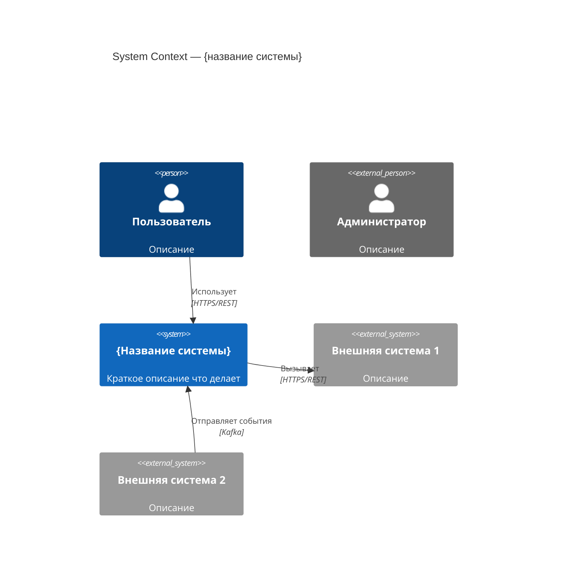
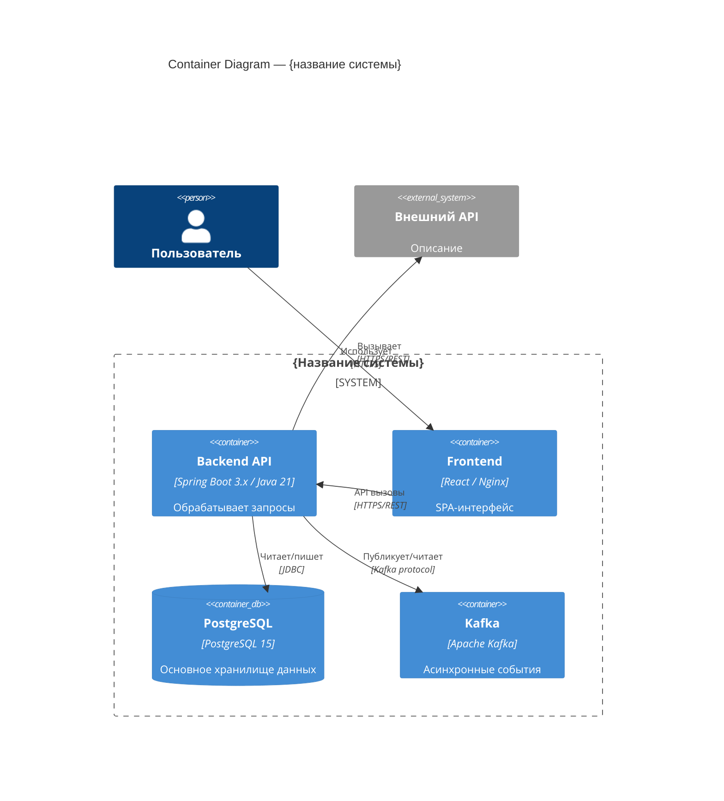
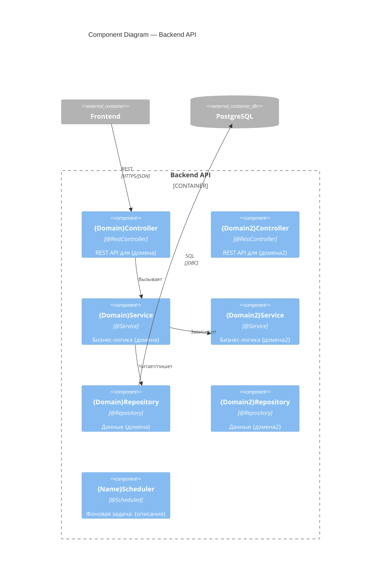

# Restore C4 architecture diagrams for Java project

## Goal

По кодовой базе восстановить архитектурную документацию в нотации C4,
представив её в виде Mermaid-диаграмм и текстовых описаний.
Результат сохранить в файл `docs/architecture.md`.

---

## Inputs

- Исходный код Java/Spring Boot проекта в рабочей директории
- `build.gradle` / `pom.xml` — зависимости
- `application.yml` / `application.properties` — конфигурация
- Файлы Docker/docker-compose (если есть)
- `AGENTS.md` / `CODEX.md` — проектные инструкции (если есть)

---

## Steps

### 1. Изучить технологический стек

```
find . -name "build.gradle" -o -name "pom.xml" | head -5
```

- Прочитать `build.gradle` / `pom.xml` — все зависимости и модули
- Прочитать `application.yml` — datasource, broker URLs, внешние API, порты
- Найти Docker/docker-compose файлы — инфраструктурные компоненты
- Найти `@SpringBootApplication` — точки входа

### 2. Инвентаризировать контейнеры (C2)

```
grep -r "@SpringBootApplication" --include="*.java" -l
grep -r "datasource\|kafka\|redis\|rabbit\|s3" application.yml --include="*.yml" -i
```

Определить:
- Модули Gradle/Maven — отдельные развёртываемые JAR/сервисы
- БД: тип (PostgreSQL, MySQL, H2), имя схемы
- Брокеры: Kafka topics, RabbitMQ exchanges
- Внешние HTTP-сервисы: URL из конфига, RestTemplate/WebClient/Feign-клиенты
- Хранилища файлов: S3, локальная ФС
- Кэш: Redis, Caffeine

### 3. Инвентаризировать Spring-компоненты (C3)

```
grep -r "@RestController\|@Service\|@Repository\|@Scheduled\|@KafkaListener\|@RabbitListener" \
     --include="*.java" -l
```

Собрать списки:
- `@RestController` с их URL-prefix
- `@Service` с зонами ответственности
- `@Repository` / JPA-репозитории с агрегатами
- `@Scheduled` бины — фоновые задачи
- `@KafkaListener` / `@RabbitListener` — консьюмеры

### 4. Определить пользователей системы

- Кто вызывает API: пользователи, другие сервисы, CI/CD
- Роли и типы доступа (из Spring Security конфигурации или README)

### 5. Построить C1 — System Context



### 6. Построить C2 — Container Diagram



### 7. Построить C3 — Component Diagram (Backend API)



### 8. Записать результат в `docs/architecture.md`

Создать или перезаписать файл со следующей структурой:

```markdown
# Архитектура системы {название}

## Обзор
{2–3 абзаца: назначение, технологии, масштаб}

## Технологический стек

| Компонент | Технология | Версия |
|-----------|-----------|--------|
| Backend   | Java / Spring Boot | ... |
| Database  | PostgreSQL | ... |

---

## C1 — System Context

{Mermaid C4Context диаграмма}

### Описание взаимодействий
- **{Актор}** → **{система}**: {описание}

---

## C2 — Container Diagram

{Mermaid C4Container диаграмма}

### Контейнеры

| Контейнер | Технология | Ответственность |
|-----------|-----------|-----------------|
| Backend API | Spring Boot | ... |

---

## C3 — Component Diagram (Backend API)

{Mermaid C4Component диаграмма}

### Компоненты

| Компонент | Тип | Ответственность |
|-----------|-----|-----------------|
| {Name}Controller | @RestController | ... |

---

## Ключевые потоки данных

### Поток 1: {название сценария}
1. {актор} → {компонент}: {действие}
2. {компонент} → {компонент}: {действие}

---

## Известные ограничения и технический долг
- {ограничение}: {описание}
```

---

## Output format

- Файл `docs/architecture.md` в корне проекта
- Три Mermaid-диаграммы: C4Context, C4Container, C4Component
- Таблицы компонентов и стека под каждой диаграммой
- Раздел ключевых потоков данных

---

## Constraints

- Описывать только то, что реально найдено в коде — не выдумывать компоненты
- Если компонент непонятен — описать как `Unknown / TBD` и указать, где он встречается
- Не писать код, только документацию
- Mermaid-синтаксис должен быть валидным
- Если существует `AGENTS.md` или `CODEX.md` — прочитать их перед началом работы для понимания контекста проекта
- Не изменять никакие файлы, кроме `docs/architecture.md`
